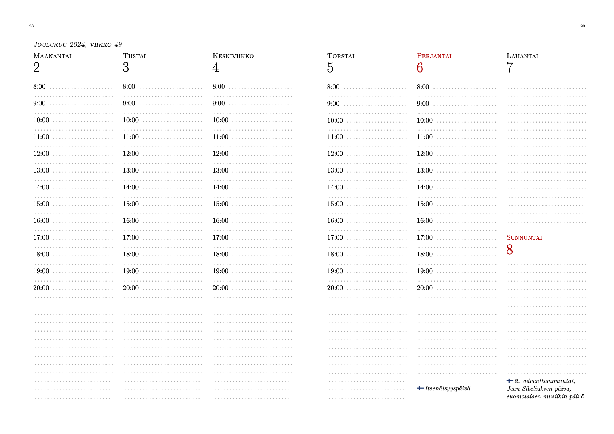

# PDF calendar generator

## Introduction

This repository contains a Python script and LaTeX template files for
generating a traditional printable paper calendar.

Each week is laid out on a spread of two A5 pages. The first day of
week in the layout is Monday.

## Installation and use

### Requirements

1. Install [TeX Live](https://tug.org/texlive/), Python 3, and GNU Make on your computer. Use the appropriate packaging system depending on your operating system.
1. Run `make venv` to set up a [Python venv](https://docs.python.org/3/library/venv.html) for the calendar generator script.

### Creating the calendar

1. Run `make`
1. If the command succeeds, `calendar.pdf` contains the generated calendar file.
1. To change the language or time range of the calendar, or to otherwise change the output, see [Customisation](#Customisation) below.

### Creating folios (or signatures or gatherings, whichever term you want to use) for bookbinding

To create a PDF file containing 5-sheet signatures suitable for binding the calendar into a book,

1. Run `make signatures`
2. `signatures.pdf` contains now the calendar in a printable signature format.

Note that in typical A4 printer paper the grain runs across the long
end of the sheet. If you fold these sheets in half, the grain
direction is wrong for bookbinding. The other obvious option would be
printing the calendar on A3 paper with four pages per side of sheet
(i.e., quartos) and folding them twice to obtain A5 pages.
Unfortunately, most A3 paper is short grain, which again leaves you
with incorrect grain direction.

Hence, you should either try to find short-grain A4 paper or
long-grain A3 paper to obtain good results for your calendar bound
into a book.

### Creating quartos and other large sheets for printing

If you want to create [quartos](https://en.wikipedia.org/wiki/Quarto)
or other large-format prints of this calendar, I recommend using
[bookbinder-js](https://momijizukamori.github.io/bookbinder-js).

I have used [these
settings for bookbinder-js](https://momijizukamori.github.io/bookbinder-js/?pageLayout=quarto&customSigLength=0&rotatePage=true&flyleafs=0&sigLength=3&printFile=aggregated&paperSize=A3)
to print the calendar onto A3 paper with four pages on each sheet.

## The structure of this calendar generator

The calendar generator consists of the following components:

* [cal-generator.py](cal-generator.py): A python script for generating the calendar.
* [calendar.tex](calendar.tex): The main LaTex file for the calendar, which contains the LaTeX document and functions for laying out the pages. To customise or change the layout, you'll have to edit this file.
* [important-days.json](important-days.json): A JSON file containing holidays and other important days that you want to print into the calendar.
* [important-days.schema.json](important-days.schema.json): A JSON schema file to help with checking the format of important-days.json.
* [requirements.txt](requirements.txt): PIP input file for installing Python libraries.
* [cal-week-template.tex.template](cal-week-template.tex.template) and [weekdays.tex.template](weekdays.tex.template): template files used by cal-generator.py to create the calendar.
* [signatures.tex](signatures.tex): A LaTeX document for creating gatherings (or signatures) suitable for bookbinding.
* [Makefile](Makefile): a makefile containing the commands for generating the calendar.

## Customisation

This calendar generator can be customised in a limited way.

### Start & end dates

To change the first and last date of the calendar, change
`START_DATE` and `END_DATE` in [Makefile](Makefile).

Note that `START_DATE` must be a Monday and `END_DATE` must be a Sunday.

### Language

To change the language for week days and month names, change `LOCALE`
in [Makefile](Makefile).

In their current form, the calendar files and templates contain some
hard-coded texts in Finnish. To create a calendar in another language,
you'll just have to find and change those phrases.

### Important days

The file [important-days.json](important-days.json) contains an array
of holidays and other days of importance that are printed into the
calendar. There is also a JSON schema
([important-days.schema.json](important-days.schema.json)) file used
by the calendar generator to verify the format of
[important-days.json](important-days.json).

The days in [important-days.json](important-days.json) have the following fields:

* `date`: The date in YYYY-MM-DD format.
* `name`: The text to be written into the calendar. The calendar template has three rows of fixed space for this text, so keep the text short.
* `isHoliday`: If `true`, the date is printed in red. All Sundays are printed in red by default.
* `flag`: An identifier for a flag to be printed into the calendar to mark a [flag flying day](https://en.wikipedia.org/wiki/Flag_flying_day). A corresponding image file must be present in the `images` directory with file name `images/flag_[identifier].pdf`.

[important-days.json](important-days.json) contains the Finnish
holidays and flag flying days based on information from
<https://almanakka.helsinki.fi/liputus-ja-juhlapaivat/>,
<https://intermin.fi/suomen-lippu/liputuspaivat> and
[https://www.juhlapyhät.fi](https://www.xn--juhlapyht-22a.fi/).

### Other more extensive customisations

To further modify the calendar (e.g., to start the weeks on Sundays,
or to otherwise modify the layout), you'll have to figure out how the
[calendar generator](./cal-generator.py) and the [calendar
templates](./calendar.tex) work. [calendar.tex](calendar.tex) is
implemented in relatively simple LaTeX, but it is rather long, tedious
and somewhat awkward in places. Changing it will be fiddly.

## License

© 2024. This work is openly licensed via
[CC0](https://creativecommons.org/publicdomain/zero/1.0/).
